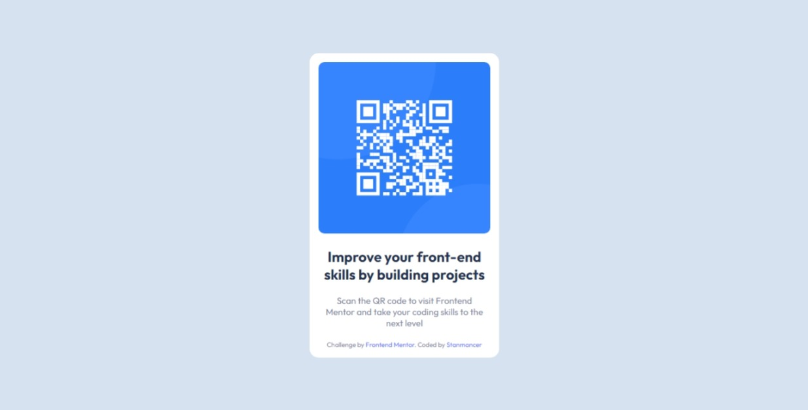

# Frontend Mentor - QR code component solution

This is a solution to the
[QR code component challenge on Frontend Mentor](https://www.frontendmentor.io/challenges/qr-code-component-iux_sIO_H).
Frontend Mentor challenges help you improve your coding skills by building
realistic projects.

## Table of contents

- [Overview](#overview)
  - [Screenshot](#screenshot)
  - [Links](#links)
- [My process](#my-process)
  - [Built with](#built-with)
  - [What I learned](#what-i-learned)
  - [Continued development](#continued-development)
  - [Useful resources](#useful-resources)
- [Author](#author)

## Overview

### Screenshot



### Links

- Solution URL: [Add solution URL here](https://your-solution-url.com)
- Live Site URL: [Add live site URL here](https://your-live-site-url.com)

## My process

### Built with

- Semantic HTML5 markup
- CSS custom properties
- Flexbox

### What I learned

- First time using git with VS code
- I learned how to add icons to page titles
- I also learned how to use custom(local) fonts in css. A snippet is showm
  below:

```css
@fontface {
  font-family: "custom-font-name";
  src: url("custom-font-url");
}
```

### Continued development

- I want to get more accustumed to making responsive pages
- I still want to learn more on using custom fonts, using fonts without having
  to download them.

### Useful resources

- [Using Git with VS code](https://www.youtube.com/watch?v=i_23KUAEtUM) - This
  helped me use git with VS code for my first time. I really liked this pattern
  and will use it going forward.
- [How to Add a Custom Font to Your Website](https://www.youtube.com/watch?v=AAU25Fo4bFY) -
  This is an amazing video which helped me learn to use custom fonts. I'd
  recommend it to anyone still learning this concept.

## Author

- Website - [Lucky Avbunufe](https://limey.io/stanmancer)
- Frontend Mentor -
  [@Stanmancer](https://www.frontendmentor.io/profile/Stanmancer)
- Twitter - [@Stanmancer](https://www.twitter.com/stanmancer)
